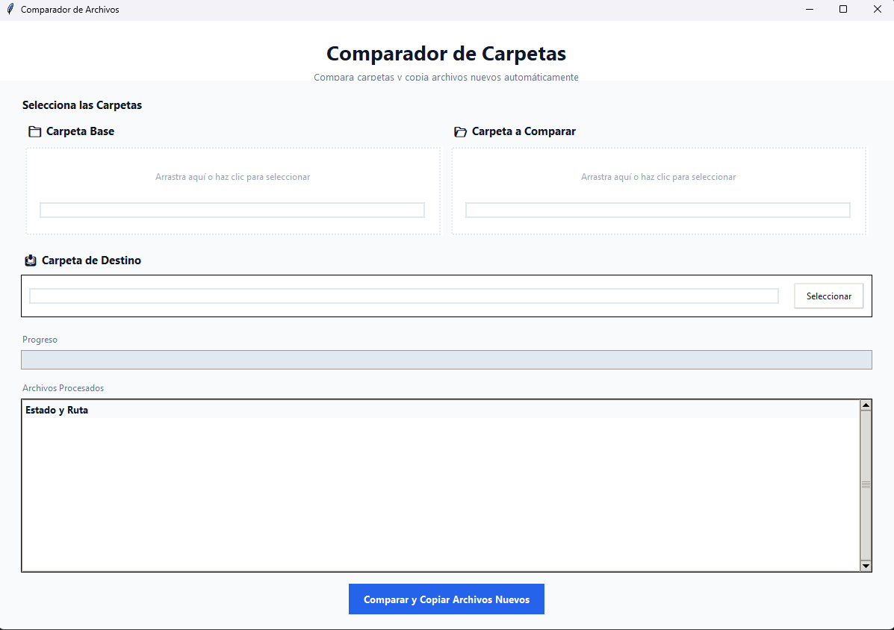

# 📁 Comparador de Carpetas



Una aplicación de escritorio moderna y profesional para comparar carpetas y copiar archivos nuevos automáticamente.


## ✨ Características

- 🎨 **Interfaz moderna y profesional** con diseño intuitivo
- 🖱️ **Drag & Drop** - Arrastra carpetas directamente a la aplicación
- 🔍 **Comparación inteligente** - Identifica archivos nuevos entre carpetas
- 📊 **Progreso en tiempo real** - Visualiza el proceso de copia
- 📝 **Registro detallado** - Genera un log completo de todas las operaciones
- 🗂️ **Organización automática** - Crea carpetas con fecha para cada comparación
- ⚡ **Rápido y eficiente** - Maneja grandes cantidades de archivos

## 📥 Descarga e Instalación

### Opción 1: Ejecutable (Windows)

1. Ve a la sección [Releases](https://github.com/tu-usuario/comparador-carpetas/releases)
2. Descarga `ComparadorCarpetas-Windows.zip`
3. Extrae el archivo ZIP
4. Ejecuta `ComparadorCarpetas.exe`

**¡No requiere instalación de Python!**

### Opción 2: Desde el código fuente

#### Requisitos previos
- Python 3.8 o superior
- pip (gestor de paquetes de Python)

#### Instalación

1. Clona el repositorio:
```bash
git clone https://github.com/tu-usuario/comparador-carpetas.git
cd comparador-carpetas
```

2. Instala las dependencias:
```bash
pip install tkinterdnd2
```

3. Ejecuta la aplicación:
```bash
python src/main.py
```

## 🚀 Uso

### Método 1: Drag & Drop (Recomendado)

1. **Arrastra la carpeta base** a la primera zona (izquierda)
2. **Arrastra la carpeta a comparar** a la segunda zona (derecha)
3. **Selecciona la carpeta de destino** donde se guardarán los archivos nuevos
4. Click en **"Comparar y Copiar Archivos Nuevos"**

### Método 2: Selección manual

1. Haz **clic** en la primera zona y selecciona la carpeta base
2. Haz **clic** en la segunda zona y selecciona la carpeta a comparar
3. **Selecciona** la carpeta de destino
4. Click en **"Comparar y Copiar Archivos Nuevos"**

### ¿Cómo funciona?

La aplicación compara los archivos entre dos carpetas:

- **Carpeta Base**: La carpeta de referencia
- **Carpeta a Comparar**: La carpeta que contiene posibles archivos nuevos

Los archivos que **existen en "Carpeta a Comparar"** pero **NO en "Carpeta Base"** se copiarán a la carpeta de destino.

### Organización de archivos

Los archivos se guardan en una carpeta con el formato:
```
NombreCarpetaComparada_YYYY-MM-DD/
```

Ejemplo:
```
Documentos_2026-01-15/
├── archivo1.pdf
├── archivo2.docx
└── registro_copia.txt
```

## 📋 Características técnicas

- **Preserva la estructura de carpetas** - Mantiene la jerarquía original
- **Metadatos conservados** - Fechas de modificación y creación
- **Subcarpetas incluidas** - Búsqueda recursiva en todos los niveles
- **Registro completo** - Archivo `.txt` con todas las operaciones

## 🛠️ Compilar el ejecutable

Si quieres compilar tu propio ejecutable:

```bash
# Instalar PyInstaller
pip install pyinstaller

# Compilar
pyinstaller --onefile --windowed --name "ComparadorCarpetas" --icon=img/icon.ico src/main.py
```

El ejecutable se generará en la carpeta `dist/`.